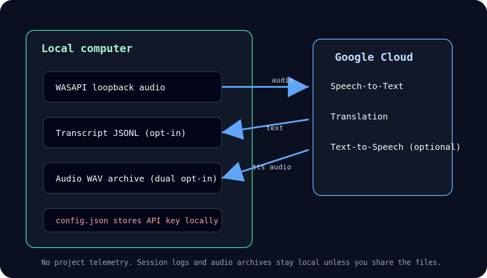

# Privacy Statement — TUI Translator

**Plain-English summary of what this program captures, where your data goes,
and how you control it.**



---

## 1. What audio this program captures

TUI Translator uses the **Windows WASAPI loopback** interface to listen to the
audio your computer is playing back through its speakers or headphones.  This
means:

- It captures **everything currently audible on your playback device** — all
  meeting participants, system sounds, and any other audio source active at the
  same time.
- It does **not** access your microphone and does not capture audio from other
  applications' private channels.
- Loopback capture requires no special Windows permission beyond playing audio
  normally.

**Your responsibility:** You are responsible for ensuring that you have the
right to record and process the audio of every participant in the meeting.
Local laws and meeting platform terms of service vary.  This program does not
obtain consent on your behalf.  Inform participants if required.

---

## 2. Where your data goes

Data flow depends on which providers are enabled in `config.json`.  Data stays
on your device except when it is sent to the cloud providers you choose in that
file.

### Local state stored on your device

The following fields are written to your local config and never leave your
device:

| Field | Storage | Sensitivity | Purpose |
|-------|---------|-------------|---------|
| `onboarding_completed_at` | `%APPDATA%\tui-translator\config.json` | Non-PII timestamp (ISO 8601 UTC) | Suppress re-showing first-run wizard |

### Default mode (local-first)

| Data | Destination | When |
|------|-------------|------|
| Raw audio chunks (PCM) | Local Whisper STT (CPU only) | Continuously while listening — audio never leaves the device by default |
| Recognised transcript text | Google Cloud Translation API | After each utterance when `mt_provider = "google"` and `google_api_key` is configured |
| Translated text | Google Text-to-Speech API | Only when `tts_enabled: true` |

Audio never leaves your device for transcription when `stt_provider = "local"`
(the default) and the subtitle pipeline is running.  Transcript text is sent to
Google Cloud Translation only when `mt_provider = "google"` and
`google_api_key` is configured; with no Google key and no local MT provider, the
app starts in metrics-only mode and does not produce transcript text to send.
TUI Translator never sends audio or text to any third party other than the cloud
providers you configure.

When `google_api_key` is set, it is stored in plain text in
`%APPDATA%\tui-translator\config.json`.  It is never transmitted anywhere
except as an API key on HTTPS requests to Google APIs.

### Local STT mode (`stt_provider: "local"`, the default)

With the default `stt_provider: "local"`:

- **Audio never leaves your device** for transcription — the Whisper model runs
  entirely on your CPU.
- Transcript text is sent to **Google Cloud Translation** by default unless
  `mt_provider: "local"` is configured with the OPUS-MT model installed.
- Text-to-speech audio synthesis (if enabled) still uses Google Cloud.

Once the Whisper model file (`ggml-tiny.bin`) is downloaded, local STT needs
no internet connection.

**Full offline** (no data leaving your device at all) requires both
`stt_provider: "local"` and `mt_provider: "local"`.  Local machine translation
is available (LF-04); set `mt_provider: "local"` and install the OPUS-MT ONNX
bundle to run completely without a network connection.

### Cloud fallback consent (`mt_cloud_fallback`)

> ⚠️ **API key presence is NOT consent to send data to the network.**
> Setting `google_api_key` enables Google STT/MT only when the matching
> provider field (`stt_provider = "google"` or `mt_provider = "google"`)
> is also set, **or** when `stt_provider = "local"` combined with the
> default `stt_fallback_policy = "google-when-keyed"` triggers a Google
> STT fallback after a permanent local-STT error.  Set
> `stt_fallback_policy = "none"` to disable that fallback.  In local-MT
> mode, an *unsupported language pair* will **never** be translated by
> Google unless you also opt in via `mt_cloud_fallback: "google"`.

| Configuration | Behaviour on unsupported pair (local MT) |
|---------------|-------------------------------------------|
| `mt_provider: "local"`, `mt_cloud_fallback` absent | Visible error in the status bar. Transcript text is **not** sent to Google. |
| `mt_provider: "local"`, `mt_cloud_fallback: "google"` (+ `google_api_key`) | Transcript text for the unsupported pair is sent to Google Cloud Translation, exactly as if `mt_provider = "google"` were configured for that pair. |
| `mt_provider: "google"` (default) | Every transcript is sent to Google Cloud Translation. |

`mt_cloud_fallback` accepts only the value `"google"` (or absent).  Changing
it requires restarting the application.  See
`docs/adr/jv-08-default-eligibility-decision.md` for the decision record
behind the default.

---

## 3. Session transcript recording

Session recording is **enabled by default** (up to 100 sessions retained).

| Setting | Effect |
|---------|--------|
| `session_store.enabled: true` (default) | A JSONL transcript log is written to `%LOCALAPPDATA%\tui-translator\sessions\` (or a custom directory). Up to `max_sessions` files are retained; default 100. |
| `session_store.enabled: false` | No session files are written to disk at all. |

### What is recorded

When recording is enabled, each session log contains **transcript text only**:

- Recognised source-language utterances and their translations.
- Timestamps and audio-span markers (start/end offsets in milliseconds).
- Provider names, latency measurements, and estimated cost figures.
- Session metadata: app version, languages, capture-device label.

**Raw audio is never saved to disk by default.**  No audio file is created by any
configuration option unless you explicitly enable the audio archive and confirm
consent (see §3.2 below).

### Retention

Session logs are plain JSONL files under per-session subdirectories in the
sessions directory.

The application **automatically evicts the oldest sealed sessions** (LF-06)
when either of the following limits is reached:

| Config key | Default | Effect |
|------------|---------|--------|
| `session_store.max_sessions` | `100` | Keep at most this many session directories; oldest sealed sessions are pruned first. |
| `session_store.total_bytes_cap` | `0` (disabled) | Delete oldest sessions until total on-disk bytes are below this cap. |
| `session_store.retention_days` | `0` (disabled) | Delete sessions whose newest file is older than this many days. |

The **active session** is never deleted by eviction.  Set
`session_store.total_bytes_cap` and `session_store.retention_days` to `0` to
disable size- and age-based eviction; `session_store.max_sessions` still caps
the number of retained sealed sessions.  You are always responsible for
managing files beyond what these automatic limits cover.

---

## 3.2. Raw audio archive (opt-in, issue #228)

Raw audio archiving is **disabled by default** and requires two explicit opt-in
signals in `config.json`:

```json
"audio_archive": {
  "store_audio": true,
  "consent_given": true
}
```

If either `store_audio` or `consent_given` is absent or `false`, no audio file
is ever created.  The application also emits a visible warning on startup when
archiving is active.

### What is archived

A single WAV file per session is written to
`%LOCALAPPDATA%\tui-translator\audio-archive\` (or a custom directory).  The
WAV contains **every sound that played through your speakers or headphones**
during the session — meeting audio, system sounds, notification chimes, music.
It does **not** capture your microphone.

| Setting | Default | Effect |
|---------|---------|--------|
| `audio_archive.store_audio` | `false` | Master switch; must be `true` to enable. |
| `audio_archive.consent_given` | `false` | Consent confirmation; must be `true` to enable. |
| `audio_archive.directory` | `null` | Custom archive directory; omit for default. |
| `audio_archive.max_size_mb` | `0` | Soft per-file quota in MiB; `0` = unlimited. |
| `audio_archive.total_bytes_cap` | `0` | Total archive retention cap in bytes; `0` = unlimited. |
| `audio_archive.retention_days` | `0` | Archive retention window in days; `0` = unlimited. |

### Retention

WAV files are written under per-session subdirectories of the archive
directory.

The application **automatically evicts the oldest sealed archive sessions**
(LF-06) using the archive-specific `audio_archive.total_bytes_cap` and
`audio_archive.retention_days` limits.  These use the same oldest-sealed-session
eviction mechanics as transcript retention, but they are configured separately
from `session_store.total_bytes_cap` and `session_store.retention_days`.
Enable `max_size_mb` to cap the size of each individual session's audio
segments.  The active session is never deleted.  You are responsible for
managing files beyond what these automatic limits cover.

---

## 4. What stays on your device

The table below summarises which data touches external networks.

| Item | Stays local | Leaves device |
|------|:-----------:|:-------------:|
| Audio captured from speakers | ✅ processed by local Whisper — audio never leaves the device (`stt_provider = "local"`, the default) | Only sent to cloud speech recognition when `stt_provider = "google"` |
| Whisper model file | ✅ | Never |
| Transcript text | ✅ | Sent to Google MT when `mt_provider = "google"` (default); stays local when `mt_provider = "local"` |
| Translated text | ✅ | Sent to Google TTS if `tts_enabled: true` |
| Session JSONL log | ✅ | Never |
| `config.json` (incl. API key) | ✅ | Never |
| Application log (`tui-translator.log`) | ✅ | Never |

---

## 5. Logs and diagnostics

The application writes a diagnostic log to the OS temp directory
(`tui-translator.log`).  This log contains:

- Tracing spans and timing events from internal components.
- Warning and error messages.

It does **not** contain transcript text, API responses, or API keys.

---

## 6. No telemetry

TUI Translator does not include any crash-reporting, analytics, update-check,
or telemetry service.  No data is sent to the project authors or maintainers.

---

## 7. Third-party services

The only external services contacted at runtime are:

| Service | Provider | Purpose | Optional |
|---------|----------|---------|----------|
| Speech-to-Text API | Google Cloud | Convert audio to text | Disabled by default (`stt_provider: "local"`); enable with `stt_provider: "google"` |
| Cloud Translation API | Google Cloud | Translate transcript | Default when `mt_provider: "google"`; disable with `mt_provider: "local"` (requires OPUS-MT bundle) |
| Text-to-Speech API | Google Cloud | Speak translated text | Yes — disabled by default (`tts_enabled: false`) |

No other network connections are made.

---

## 8. Consent and compliance

- You are the data controller for any personal data captured through this
  application.
- This program does not implement a consent mechanism on behalf of meeting
  participants.
- If `tts_routing` is `virtual_mic` or `both` and a meeting app uses the paired
  virtual cable as its microphone, other participants may hear an
  **AI-generated translated voice**. Tell participants before enabling this
  route. The translated voice can be delayed, incomplete, or inaccurate.
- Applicable regulations (GDPR, local recording laws, etc.) are your
  responsibility to comply with.


---

## 9. WBS-08 Privacy Artifact Controls - Developer Checklist

This section is for **developers and CI maintainers**.  It documents the exact
controls that prevent real session transcripts, audio recordings, and
API-key-bearing reports from entering the repository, and the commands to
verify those controls are effective.

### 9.1. Gitignore coverage

The following patterns are enforced in `.gitignore`:

| Pattern | What it guards |
|---------|---------------|
| `sessions/` | Runtime session transcript directory (JSONL logs) |
| `*.session.jsonl` | Stray session-log file at repo root |
| `audio-archive/` | Runtime audio archive directory (WAV files) |
| `eval-session/` | Evaluation / measurement report directory |
| `/target/` (pre-existing) | Build artefacts including `target/eval-session/` |
| `config.json` (pre-existing) | Local config containing the real API key |
| `.env` / `.env.*` (pre-existing) | Environment variable files |

`*.jsonl` and `*.wav` are **not** added globally because committed test
fixtures (`tests/fixtures/*.jsonl`, `tests/fixtures/*.wav`,
`tests/soak/soak_audio.wav`) must remain visible to `cargo test`.  The
commit-gate hook (GUARD 5) enforces the restriction at commit time instead.

### 9.2. Commit-gate hook (GUARD 5 - artifact-guard.py)

`.github/hooks/artifact-guard.py` runs as a `preToolUse` hook on every
`git commit` command.  It blocks:

- Any `*.jsonl` or `*.wav` file staged for commit that is **not** under
  `tests/fixtures/` or `tests/soak/`.
- Any file staged from inside `sessions/`, `audio-archive/`, or
  `eval-session/` directories.

### 9.3. Scan commands for WBS-08 evidence

Run these commands from the repository root to verify no private artifacts
have entered version control.

#### Scan 1 - No real JSONL logs committed

```powershell
git ls-files "*.jsonl"
# Expected: only synthetic JSONL fixtures under tests/fixtures/
```

#### Scan 2 - No real audio WAV committed outside fixtures

```powershell
git ls-files "*.wav"
# Expected: only tests/fixtures/*.wav and tests/soak/soak_audio.wav
```

#### Scan 3 - No API keys in committed files

```powershell
# Search committed files for Google API key pattern (AIza...) - exclude test fixtures
git ls-files | Where-Object { $_ -notmatch "^tests/" } | ForEach-Object {
    $m = Select-String -Path $_ -Pattern "AIza[0-9A-Za-z_\-]{35}" -Quiet -ErrorAction SilentlyContinue
    if ($m) { Write-Host "FOUND POSSIBLE REAL KEY IN: $_" }
}
# Expected: no output (zero matches = passing condition)
```

#### Scan 4 - sessions/ and audio-archive/ are gitignored

```powershell
New-Item -ItemType Directory -Force sessions, audio-archive | Out-Null
"x" | Set-Content sessions\.gitkeep
"x" | Set-Content audio-archive\.gitkeep
git status --ignored --short sessions audio-archive
# Expected output:
#   !! audio-archive/
#   !! sessions/
# "!!" means gitignored; "??" would mean untracked (fail)
Remove-Item -Recurse -Force sessions, audio-archive
```

#### Scan 5 - eval-session/ is gitignored

```powershell
New-Item -ItemType Directory -Force eval-session | Out-Null
"x" | Set-Content eval-session\.gitkeep
git status --ignored --short eval-session
# Expected: "!! eval-session/"  (ignored)
Remove-Item -Recurse -Force eval-session
```

#### Scan 6 - Full ignored-file audit

```powershell
git status --ignored --short | Where-Object { $_ -match "^!!" }
# Review output; confirm sessions/, audio-archive/, eval-session/, config.json
# and .env appear as ignored when those files/directories exist on disk.
```

### 9.4. Audio consent requirements

The `audio_archive` feature requires two explicit opt-in fields:

```json
"audio_archive": {
  "store_audio": true,
  "consent_given": true
}
```

If either field is absent or `false`, **no WAV file is written**.  The
application also emits a visible warning on the TUI status bar when archiving
is active.

Before enabling this feature:
1. Inform all meeting participants that audio is being recorded.
2. Comply with applicable local recording-consent laws.
3. Delete archived WAV files when no longer needed.
4. Never commit WAV files to the repository (GUARD 5 enforces this automatically).

### 9.5. Evidence summary

| Control | Mechanism | Verification |
|---------|-----------|-------------|
| `sessions/` gitignored | `.gitignore` | Scan 4 |
| `audio-archive/` gitignored | `.gitignore` | Scan 4 |
| `eval-session/` gitignored | `.gitignore` | Scan 5 |
| No JSONL outside fixtures | `artifact-guard.py` GUARD 5 | Scan 1 |
| No WAV outside fixtures | `artifact-guard.py` GUARD 5 | Scan 2 |
| No API keys committed | `secret-detector.py` GUARD 2 | Scan 3 |
| Audio requires explicit consent | Dual opt-in in `config.json` | §3.2 + §9.4 |

---

*For technical implementation details, see `config.example.json` and the source
under `src/session/`, `src/audio/`, and `src/providers/`.*
