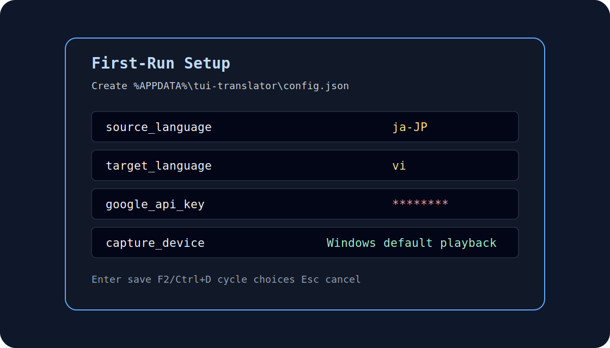
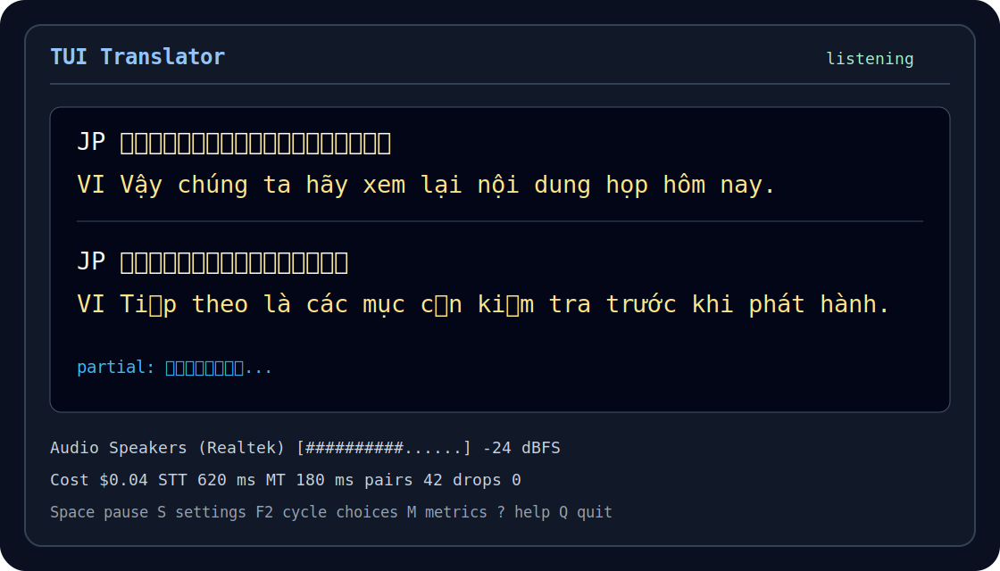
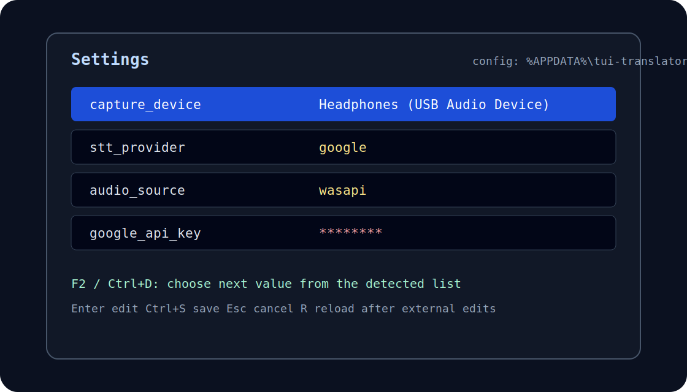
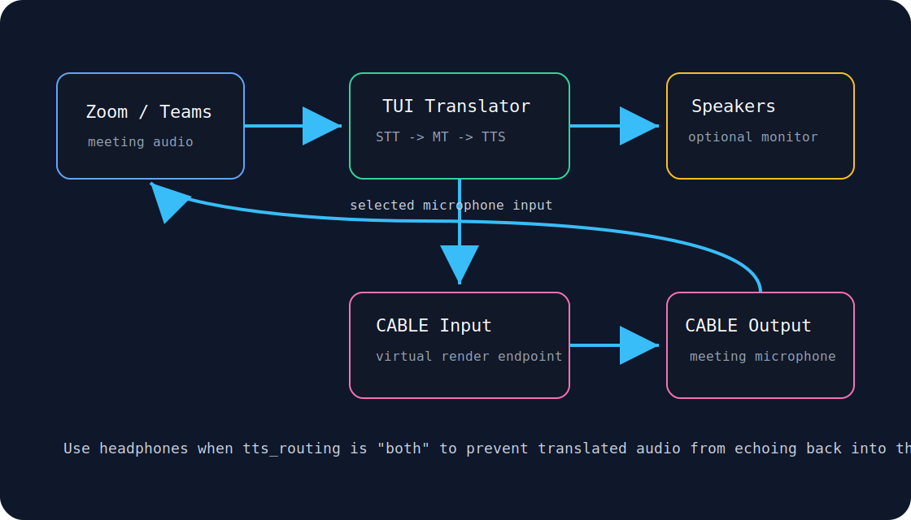

# TUI Translator — Setup and Usage Guide

This guide is written for users who are not software developers.
It takes about ten minutes from start to finish.

> **Current release status:** packaged Windows builds are published on the
> [Releases page](https://github.com/magicpro97/tui-translator/releases) as
> **pre-releases** until Layer 5 human-acceptance review is complete.
> The build is self-contained (no VC++ Redistributable needed) and the full
> v1 runtime is merged on `main`, but the final named-human review gate is
> still pending. This guide describes the intended end-user setup flow for all
> packaged builds.

---

## Fast path

1. Download and extract the release ZIP.
2. Start `tui-translator.exe`.
3. Complete first-run setup; the app saves `%APPDATA%\tui-translator\config.json`.
4. Join a meeting, keep the terminal visible, and use **S** for settings or
   **F2/Ctrl+D** to choose from device/provider lists instead of typing.

## Table of contents

| Section | Use it for |
|---------|------------|
| [Steps 1-5](#step-1--download-the-application) | Download, configure, run, and join a meeting |
| [Key controls](#key-controls-at-a-glance) | Runtime shortcuts and settings selection |
| [Virtual microphone](#optional-route-translated-speech-into-zoom-or-teams) | Route translated TTS into Zoom or Teams |
| [Speech quality](#speech-windowing-and-translation-quality) | Tune VAD, latency, and sentence aggregation |
| [Troubleshooting](#troubleshooting) | Fix API key, capture, and cost issues |
| [Offline / local STT](#optional-offline--local-speech-to-text-mode) | Run speech recognition locally |
| [Offline quality evaluator](#offline-quality-evaluator-eval_session) | Score session logs without network access |

## Use as a live interpreter

Route translated speech into Zoom or Teams as a virtual microphone so peers
hear an AI-generated translated voice.  For full details see
[docs/12-virtual-mic-setup.md](docs/12-virtual-mic-setup.md).

1. Install **VB-Audio Virtual Cable** from
   [vb-audio.com](https://vb-audio.com/Cable/) and restart Windows when the
   installer asks.
2. Set `tts_routing = "virtual_mic"` and
   `virtual_mic_device = "CABLE Input (VB-Audio Virtual Cable)"` in
   `config.json`, or press **S** inside the app to open the settings editor and
   change both fields there.
3. Restart tui-translator and confirm the **READY** badge in the status bar.
4. In Zoom or Teams, open your microphone settings and select
   **CABLE Output (VB-Audio Virtual Cable)** as the microphone.
5. Speak or play meeting audio — participants should now hear the translated
   output.  Use the consent notice in
   [docs/12-virtual-mic-setup.md](docs/12-virtual-mic-setup.md) to inform
   participants before you enable this route.

---

## What the screens look like







---

## What you need before you start

- A **Windows 10 or Windows 11** computer (64-bit).
- **Zoom** installed and working normally on that computer.
- **For fully local operation (no Google account needed):** download the
  release binary and set `stt_provider = "local"`, `mt_provider = "local"`,
  and/or `tts_provider = "local"` in your config. Local models (~480 MB total)
  download automatically on first run — a Y/n consent prompt appears before
  any download begins.
- **For Google Cloud translation/TTS:** a Google Cloud API key with Translation
  (and optionally TTS) enabled.  Without a Google key and without local models,
  the app starts in metrics-only mode and shows no live subtitles.

---

## Step 1 — Download the application

Download the latest package from the
[Releases page](https://github.com/magicpro97/tui-translator/releases) and
extract it anywhere you like — for example, `C:\Tools\tui-translator\`.

The archive contains `tui-translator.exe`, `config.example.json`, and
`USAGE.md`. No Visual C++ Redistributable is required; the runtime is
self-contained.

---

## Step 2 — Complete first-run setup

1. Start the app once (see Step 4 below).
2. The **First-Run Setup** screen appears automatically if you do not already
   have a saved config.
3. Fill in at least these values:

   | Setting | What to put | Example |
   |---------|-------------|---------|
   | `source_language` | The language spoken in the meeting (BCP-47 code) | `"ja-JP"` for Japanese |
   | `target_language` | The language you want to read subtitles in (BCP-47 code) | `"vi"` for Vietnamese |
   | `google_api_key` | **Optional** when using local providers; required for Google Cloud translation and TTS | `"AIzaSy…"` |
   | `stt_provider` | `"local"` for CPU-local Whisper (default), or `"google"` for Google Cloud STT | `"local"` |
   | `mt_provider` | `"local"` for CPU-local OPUS-MT (default in local builds), `"google"` for Google Cloud, or `"llm"` for GGUF LLM (requires `local-llm-mt` build feature) | `"local"` |
   | `tts_provider` | `"local"` for CPU-local Supertonic-3 (default in local builds), or `"google"` | `"local"` |
   | `tts_enabled` | `false` to show text subtitles only; `true` to also hear translation | `false` |
   | `capture_device` | Leave blank for the Windows default playback device, or choose a playback device in settings | blank |

   This table is the minimal first-run subset. See `config.example.json` for
   optional settings such as `cost_warning_usd`, `tts_output_device`, and `glossary`.

   **Term protection (glossary):** If your meetings include technical terms, sprint
   identifiers, or proper nouns that should not be translated, add a `glossary` block:

   ```json
   "glossary": {
     "terms": ["Sprint13", "API", "MVP", "Tanaka"],
     "case_insensitive": false
   }
   ```

   Listed terms are preserved verbatim in both local (OPUS-MT) and Google Cloud
   translation. Add terms in the in-app settings editor under the
   **Glossary** section.

   Common language codes: `en-US` (English), `ja-JP` (Japanese), `zh-CN` (Mandarin),
   `ko` (Korean), `vi` (Vietnamese), `es` (Spanish), `fr` (French), `de` (German).

4. Press **Enter** to save.

The app writes your settings to:


```text
%APPDATA%\tui-translator\config.json
```

If you prefer to edit JSON manually, you can still copy `config.example.json`
and create that file yourself in the same folder.

> **Security reminder:** `%APPDATA%\tui-translator\config.json` contains your API key.
> Do not share it, do not upload it, and do not email it.

---

## Step 3 — Enable the Google Cloud APIs

Your API key must have permission to use three Google Cloud services.
Follow these steps in the [Google Cloud Console](https://console.cloud.google.com/):

1. **Sign in** at <https://console.cloud.google.com/>.
2. In the top bar, make sure the correct **project** is selected (the one whose API key you are using).
3. In the left menu, choose **APIs & Services → Library**.
4. Search for **Cloud Speech-to-Text API** and click **Enable**.
5. Search for **Cloud Translation API** and click **Enable**.
6. Search for **Cloud Text-to-Speech API** and click **Enable**.
   (This one is only needed if you set `tts_enabled: true`, but it is good practice to enable it now.)
7. If you have not created an API key yet:
   - Go to **APIs & Services → Credentials**.
   - Click **Create Credentials → API key**.
   - Copy the key and paste it into the first-run setup screen as described in Step 2.
   - Optionally, click **Restrict key** and limit it to the three APIs above.

---

## Step 4 — Start the application

1. Open **Windows Terminal**, **PowerShell**, or **Command Prompt**.
2. Navigate to the folder that contains `tui-translator.exe`:

   ```
   cd C:\Tools\tui-translator
   ```

3. Run the application:

   ```
   .\tui-translator.exe
   ```

A terminal window opens showing the subtitle area and a status bar at the bottom.


> **Where the app looks for your config (resolution order):**
>
> | Priority | Path | When used |
> |----------|------|-----------|
> | 1 | Value of the `TUI_TRANSLATOR_CONFIG` environment variable | When that variable is set — overrides everything else |
> | 2 | `<folder containing tui-translator.exe>\config.json` | Portable ZIP mode, or a legacy side-by-side config from older builds |
> | 3 | `%APPDATA%\tui-translator\config.json` | Default per-user location when no executable-side config is present |
> | 4 | `<folder containing tui-translator.exe>\config.json` | Fallback path when the OS per-user config directory cannot be resolved |
> | 5 | `config.json` in the current working directory | Last resort |
>
> If an older build left `config.json` beside `tui-translator.exe` and the per-user
> config file does not exist yet, the app copies that file to
> `%APPDATA%\tui-translator\config.json` on startup. The original executable-side
> file is left unchanged. While that original file remains beside the `.exe`, it is
> still treated as the portable-mode config and continues to win lookup order.
> Remove or rename it only after you have confirmed the per-user copy is correct.
> A migration notice appears in the title bar and is written to
> `%TEMP%\tui-translator.log`.
>
> **Portable / custom-path setup:** To run with a config file at a path of your choosing,
> set `TUI_TRANSLATOR_CONFIG` before launching:
>
> ```text
> set TUI_TRANSLATOR_CONFIG=C:\path\to\my-config.json
> .\tui-translator.exe
> ```

To see the exact playback device names Windows exposes for capture, run:

```text
.\tui-translator.exe --list-audio-devices
```

In the settings editor, move to `capture_device` and press **F2** (or
**Ctrl+D**) to cycle through detected playback devices. Leave it blank to keep
capturing the Windows default playback device. Save and restart after changing
the capture device.

---

## Step 5 — Join your Zoom meeting

Start or join your Zoom meeting as you normally would.
Within a few seconds of someone speaking, bilingual subtitle lines appear:
- The **top line** shows the original speech (in the source language).
- The **bottom line** shows the translation (in your target language).

Keep the terminal window visible alongside Zoom — for example, snap it to one side of the screen.

---

## Key controls at a glance

| Key | What it does |
|-----|-------------|
| Space | Pause or resume translation |
| L | Change the target language for this session |
| S | Open the settings editor |
| F2 / Ctrl+D in settings | Cycle through the allowed values for a choice field (e.g. `capture_device`, `stt_provider`, `audio_source`, `stt_fallback_policy`) |
| T | Toggle translated audio on or off |
| M | Show or hide the metrics panel (compact/expanded) |
| R | Reload the saved config without restarting |
| ? | Show the help screen |
| Q or Ctrl+C | Quit and display a session summary |

> **Settings with choice fields:** In the settings editor, any field that accepts a fixed set
> of values (provider names, language codes, backend names) can be cycled with **F2** or
> **Ctrl+D** without typing.  The cursor must be on that field's row.
>
> **API key display:** The `google_api_key` field is masked in the TUI settings editor
> (shown as `••••••••`) to prevent accidental screen exposure.  The actual key is stored
> in plain text in `%APPDATA%\tui-translator\config.json` — keep that file private
> and do not share it.

---

## Optional: route translated speech into Zoom or Teams

TUI Translator can play translated TTS into an installed virtual audio cable so
Zoom, Microsoft Teams, or another meeting app can select that cable as its
microphone. This is the VMIC MVP path: it uses VB-CABLE, VAC, or Voicemeeter
that you install separately. It is not yet a project-owned production virtual
microphone driver.



Routing choices:

| Mode | Config value | Use when |
|------|--------------|----------|
| Speakers | `tts_routing: "speakers"` | You only want to hear translated audio locally. |
| VirtualMic | `tts_routing: "virtual_mic"` | You want the meeting app to receive the translated voice and do not need local monitoring. |
| Both | `tts_routing: "both"` | You want both local monitoring and meeting-app microphone output. Use headphones to avoid echo. |

Minimal config:

```json
"tts_enabled": true,
"tts_routing": "both",
"virtual_mic_device": "CABLE Input (VB-Audio Virtual Cable)"
```

Then choose the paired microphone endpoint in the meeting app, usually
**CABLE Output (VB-Audio Virtual Cable)** for VB-CABLE.

Before using this in a real meeting, tell participants that they may hear an
AI-generated translated voice and that translation can be inaccurate or delayed.
For exact setup steps, Zoom Original Sound / Teams Noise Suppression guidance,
troubleshooting, and automated evidence paths, see
[`docs/12-virtual-mic-setup.md`](docs/12-virtual-mic-setup.md).

---

## Speech windowing and translation quality

TUI Translator does not send audio to Google Speech-to-Text (STT) as a raw
continuous stream.  Instead it collects audio into **speech windows**, flushes
each window when a natural pause is detected, and then assembles the resulting
text fragments into complete sentences before sending them to machine
translation (MT).  Understanding these stages helps you tune the application
for different meeting styles and diagnose quality problems such as word
fragments or subtitle flicker.

---

### How a speech window is built

The diagram below shows the lifecycle from raw audio to a translated subtitle
line when Voice Activity Detection (VAD) is enabled.

```
Audio stream (time flows right)
─────────────────────────────────────────────────────────────────────────────►

[─ silence ─][─ confirming ─][──────────── speech ────────][─ post-roll ─][silence]
              ↑                                              ↑              ↑
              VAD onset                                      │         EndOfUtterance
              detected                             speech_pad_ms          fired
                                                   (post-roll)
             ◄──► pre_roll_ms
             (buffered during
              confirming,
              prepended to window)

             ◄────────────────────── STT window ────────────►
                                                             │
                                                             ▼  flush
                                                   ┌─ sentence aggregator ─┐
                                                   │ holds text until:     │
                                                   │  • sentence boundary  │
                                                   │  • sentence_max_age_ms│
                                                   └──────────┬────────────┘
                                                              │
                                                              ▼
                                                        MT (translate)
                                                              │
                                                              ▼
                                                       subtitle pane
```

**Stages explained:**

1. **Pre-roll** — While VAD is in the "confirming" state it buffers incoming
   audio.  When the onset is confirmed as real speech, up to `vad.pre_roll_ms`
   of that buffered audio is prepended to the STT window so leading consonants
   are not clipped.
2. **Speech** — Audio accumulates in the window until one of three flush
   conditions fires: a VAD EndOfUtterance signal (when
   `pipeline.early_flush_on_vad_end` is `true`), the window reaches
   `pipeline.max_window_ms`, or silence has lasted longer than
   `pipeline.idle_flush_ms` and the window is at least `pipeline.idle_min_ms`
   long.
3. **Post-roll** — `vad.speech_pad_ms` adds a short tail of silence after
   speech energy drops before EndOfUtterance is emitted.  This gives the
   speaker time to finish a trailing syllable without being cut off.
4. **Flush** — The complete window (pre-roll + speech + post-roll) is sent to
   Google STT as a single audio segment.
5. **Sentence aggregation** — The STT result is pushed into the sentence
   aggregator, which holds text that does not end with a sentence boundary
   character (`.`, `。`, `?`, `!`, etc.) and combines it with the next
   fragment.  If no sentence boundary arrives within
   `pipeline.sentence_max_age_ms`, the partial text is force-flushed to MT to
   keep subtitles moving.

---

### VAD configuration reference

All fields live inside the `"vad"` block of
`%APPDATA%\tui-translator\config.json`.  Set `"enabled": true` to
activate VAD.  All other sub-fields are optional and fall back to the defaults
shown below.

| Key | Unit | Default | Range | What it does |
|-----|------|---------|-------|--------------|
| `vad.enabled` | bool | `false` | `true` / `false` | Activates Voice Activity Detection.  When `false`, fixed-window mode uses the `max_window_ms` timer and can still flush earlier on the idle timeout. |
| `vad.threshold` | amplitude (0–1) | `0.01` | `0.0`–`1.0` | Minimum RMS energy for a chunk to be treated as speech.  Raise in noisy rooms; lower for soft speakers. |
| `vad.min_speech_ms` | ms | `100` | `>= 0` (`> 0` when VAD is enabled) | How long the audio must stay above `threshold` before the onset is confirmed as real speech (guards against noise spikes). |
| `vad.pre_roll_ms` | ms | `200` | `0`–`2000` | Audio buffered during onset confirmation that is prepended to the STT window.  Set to `0` to disable pre-roll. |
| `vad.speech_pad_ms` | ms | `300` | `>= 0` (`> 0` when VAD is enabled) | Extra silence appended after speech energy drops before EndOfUtterance fires (post-roll).  Prevents premature cuts on trailing syllables. |
| `vad.min_silence_ms` | ms | `500` | `>= 0` (`> 0` when VAD is enabled) | How long silence must persist after speech before EndOfUtterance is emitted. |

---

### Pipeline configuration reference

All fields live inside the `"pipeline"` block of your config file.  You can
omit the entire block to use built-in defaults.  Changes require a restart.

| Key | Unit | Default | Range | What it does |
|-----|------|---------|-------|--------------|
| `pipeline.max_window_ms` | ms | `3000` | `500`–`60000` | Hard upper limit on STT window duration.  If no other flush fires first, the window is sent to STT at this age.  When VAD is disabled, this also sets the regular flush cadence. |
| `pipeline.early_flush_on_vad_end` | bool | `true` | `true` / `false` | When `true`, a VAD EndOfUtterance signal flushes the window immediately for low-latency subtitles.  Set to `false` to disable that VAD-triggered flush; `max_window_ms`, idle timeout, and shutdown flushes still apply. |
| `pipeline.idle_flush_ms` | ms | `600` | `50`–`30000` | If no new audio chunk arrives for this long, the current partial window is flushed early (provided `idle_min_ms` is met). |
| `pipeline.idle_min_ms` | ms | `500` | `50`–`30000` | Minimum speech accumulated in the window before an idle flush is allowed.  Prevents tiny noise bursts from being sent to STT. |
| `pipeline.sentence_max_age_ms` | ms | `4000` | `500`–`60000` | Maximum time the sentence aggregator holds a partial text fragment before force-flushing it to MT.  Higher values improve sentence completeness; lower values reduce subtitle lag when a speaker trails off mid-sentence. |

---

### Recommended settings for common scenarios

The table below shows starting-point configurations for three common meeting
styles.  Apply the relevant values inside the `"vad"` and `"pipeline"` blocks
in your config file and restart the application.

| Scenario | `vad.enabled` | `vad.speech_pad_ms` | `vad.min_silence_ms` | `pipeline.max_window_ms` | `pipeline.sentence_max_age_ms` | Notes |
|----------|:-------------:|--------------------:|---------------------:|-------------------------:|-------------------------------:|-------|
| **Dense monologue** (one speaker, fast continuous speech) | `true` | `400` | `600` | `5000` | `6000` | Longer post-roll and silence gap reduce mid-sentence cuts during rapid speech. |
| **Dialogue** (back-and-forth, multiple speakers) | `true` | `200` | `400` | `3000` | `3000` | Shorter gaps keep subtitles snappy during fast turn-taking. |
| **VAD disabled** (fallback for noisy environments) | `false` | — | — | `3000` | `4000` | Fixed-window mode: flushes at `max_window_ms`, or earlier when the idle timeout fires.  Use when background noise causes VAD to trigger constantly. |

> **Tip:** You can also open the settings editor with **S** in the running app
> and change values without editing JSON by hand.  Save and restart after
> any `pipeline` or `vad` change.

---

### Reading the quality counters

Press **M** to open the expanded metrics panel.  The bottom line shows three
quality counters:

```
trunc:12%  flicker:3  mt:47
```

| Counter | What it means | Good target | How to improve |
|---------|--------------|-------------|----------------|
| `trunc:X%` | **Truncation rate** — the share of STT windows that hit the `max_window_ms` hard cap instead of finishing at a VAD pause, idle timeout, or sentence boundary.  High values mean speech is regularly being cut mid-utterance. | < 10 % | Raise `pipeline.max_window_ms`, or enable VAD so utterances flush at natural pause points. |
| `flicker:N` | **Flicker count** — how many times the live subtitle text shrank unexpectedly during in-flight recognition (a non-monotonic partial update).  Visible as a brief flash or replacement of text you just read. | 0 | Enable VAD to reduce out-of-order partials; or lower `pipeline.max_window_ms` to send shorter, more predictable windows. |
| `mt:N` | **MT call count** — total successful translation API calls this session.  Each call has a small billing cost.  The sentence aggregator reduces this number by batching STT fragments into full sentences before translating. | Informational | Raise `pipeline.sentence_max_age_ms` to let the aggregator combine more fragments (note: raises subtitle latency). |

---

### Storage metrics (expanded panel)

The expanded metrics panel also shows a **storage row** in the bottom section.
It has two fields on one line:

```
transcripts: 12 KB at C:\...\sessions\session-…\00001.jsonl   audio archive: 3.4 MB at C:\...\audio-archive\session-…\00001.wav
```

#### Transcript (session recorder) fields

| Field | What it shows |
|-------|---------------|
| `transcripts: <size>` | Total bytes handed to the OS for the active JSONL transcript file since the session started (monotonically non-decreasing; never resets mid-session). |
| `at <path>` | Absolute path of the active transcript segment file (`00001.jsonl`, `00002.jsonl`, … when segment rotation is enabled). |
| `transcripts: —` | Recording is disabled (`session_store.enabled: false`). |

The counter is updated by the writer task via an `AtomicU64::fetch_add` on
every successful write; it is always coherent with the next metrics-publisher
tick (≤ 1 second).  The counter only grows — if the active session directory
is evicted by `enforce_total_session_cap`, the in-memory counter is **not**
affected.

#### Audio archive fields

| Field | What it shows |
|-------|---------------|
| `audio archive: <size>` | Total PCM bytes written to WAV data chunk(s) across all segments of the current session. |
| `at <path>` | Absolute path of the WAV segment currently being written. |
| `(sealed)` | Legacy single-file archive mode reached the per-file size quota and stopped appending.  In the LF-06 per-session layout, `audio_archive.max_size_mb` rotates to the next WAV segment instead of showing a permanent sealed state. |
| `audio archive: —` | Archiving is disabled (`audio_archive.store_audio: false`) or the archive writer did not start. |
| `audio archive: (consent revoked)` | `consent_given` was set to `false` in the loaded config.  **Bytes and path are hidden** to prevent accidental privacy disclosure. |

#### Consent-gate timing

The `(consent revoked)` state is driven by an `AtomicBool` updated when
`config.json` is reloaded.  The TUI draw loop reads the same atomic on every
render tick (at most 1 second apart), so the privacy gate takes effect within
the next 1 Hz render tick in practice — no restart required.

#### Update cadence

Both storage counters are published once per second through the existing
`AppState::metrics_tx` watch channel (the same 1 Hz cadence used for all
other metrics fields).  The underlying atomics may advance faster than 1 Hz
for high-volume sessions, but the **display** lags by at most one tick.

---

### Diagnosing common quality problems

**Word fragments in subtitles** (for example, subtitles show `会議` then `の結果です` as separate
lines instead of one complete sentence)

The sentence aggregator is flushing text too early.  Try:

- Raise `pipeline.sentence_max_age_ms` (for example from `4000` to `6000`).
- Enable VAD (`vad.enabled: true`) so the window flushes at natural pauses
  rather than on a fixed timer.
- Raise `vad.speech_pad_ms` (for example to `400`) so trailing syllables are
  not cut off before VAD fires EndOfUtterance.

---

**High truncation rate (`trunc:45%` in the metrics panel, equivalent to a raw
rate of `0.45`)**

Nearly half of all STT windows are being cut at the hard cap instead of at a
natural pause.  The speaker may be talking continuously with no obvious pauses,
or `max_window_ms` is too short for the meeting's speaking pace.

- Raise `pipeline.max_window_ms` (for example from `3000` to `6000`).
- If VAD is enabled, try raising `vad.min_silence_ms` slightly (for example
  from `500` to `700`) so VAD waits a little longer before declaring
  end-of-utterance.
- If the speaker genuinely never pauses, a nonzero truncation rate is expected
  and harmless — the app sends a rolling window to STT and subtitles still
  appear continuously.

---

**Running with `vad.enabled: false` (fixed-window fallback)**

When VAD is disabled the pipeline uses **fixed-window mode**:

- Audio accumulates for up to `pipeline.max_window_ms` milliseconds and is
  then sent to STT unconditionally.
- If no new audio arrives within `pipeline.idle_flush_ms`, the partial window
  is flushed early (provided it contains at least `pipeline.idle_min_ms` of
  speech).
- The VAD-specific fields (`vad.threshold`, `vad.min_speech_ms`,
  `vad.pre_roll_ms`, `vad.speech_pad_ms`, `vad.min_silence_ms`) are ignored.
- The sentence aggregator still operates normally, combining STT fragments into
  sentences before MT.

Fixed-window mode is simpler and works in any environment, but produces more
mid-word cuts and a higher `trunc:%` reading compared to VAD-enabled mode.
It is the right choice when background noise causes VAD to trigger constantly
and flood the STT API with silent chunks.

---

## Troubleshooting

**"API key not valid" or no subtitles appear**

- Open `%APPDATA%\tui-translator\config.json` in Notepad and check the `google_api_key` value.
  Make sure there are no extra spaces, quotation marks, or line breaks inside the key.
- Confirm all three APIs are enabled in the Google Cloud Console (Step 3).
- Check that your Google Cloud project has a billing account attached.
  API calls are blocked on free-tier projects without billing.

**No audio is captured / subtitles never start**

- Make sure the Zoom meeting audio is playing through your Windows default output device
  (speakers or headphones). TUI Translator listens to the system audio output, not a microphone.
- In Windows Settings → System → Sound, confirm the correct playback device is set as the default.
- Or open the settings editor, move to `capture_device`, and press F2 to choose
  the exact playback device Zoom is using.
- Try playing any sound through the same output device (a YouTube video, for example) to confirm
  it works; TUI Translator will capture whatever Windows plays through that device.

**Subtitles appear but costs seem high**

- Press Space to pause translation whenever the meeting goes quiet or you do not need subtitles.
  Billing only accumulates while the application is actively sending audio to Google.
- Press M to open the cost panel and see the live estimate for the current session.
- Set a lower `cost_warning_usd` value in `%APPDATA%\tui-translator\config.json` to get an earlier on-screen warning.

---

## Capture-device selection — real-machine proof path

The steps below are a **manual operator checklist** to confirm that
capture-device selection works end-to-end on a real Windows machine.
Hardware interaction is required; this cannot be replaced by automated tests.

**Step 1 — List the devices Windows exposes**

```text
.\tui-translator.exe --list-audio-devices
```

The command exits immediately and prints every active render endpoint, for example:

```text
Audio capture devices for WASAPI loopback (Windows playback endpoints):
  [default] Windows default playback device (leave capture_device blank)
  - Speakers (Realtek High Definition Audio) (current Windows default)
  - Headphones (USB Audio Device)
  - CABLE Input (VB-Audio Virtual Cable)
```

Note the exact name of the device Zoom audio is playing through.

**Step 2 — Set `capture_device` in config.json**

Open `%APPDATA%\tui-translator\config.json` and set:

```json
"capture_device": "Speakers (Realtek High Definition Audio)"
```

The value must match the name from Step 1 exactly (case-sensitive).
To revert to the Windows default, set the value to `""` (empty string).

Alternatively, open the settings editor (press **S**), navigate to the
`capture_device` row, and press **F2** or **Ctrl+D** to cycle through
detected devices without typing.


**Step 3 — Start the application and confirm these three indicators**

| Indicator | Expected | Where |
|-----------|----------|-------|
| Startup log | `WASAPI loopback opened device="Speakers (…)"` — matches the name you set | `%TEMP%\tui-translator.log` |
| Subtitles | Lines appear within a few seconds of speech in the Zoom meeting | TUI main panel |
| Audio-level bar | Energy bar rises above the silence gate when audio plays | TUI metrics panel (press **M**) |

The app writes tracing output to `tui-translator.log` in the Windows temp
directory so diagnostics do not pollute the terminal UI. If that file cannot be
opened, tracing falls back to terminal stderr.

If the log shows `render device "…" was not found`, re-run Step 1 to get the
current device list and correct the name in Step 2.

**Step 4 — Verify the blank-name fallback**

Set `capture_device` to `""` in `config.json`, restart, and confirm the startup
log says `WASAPI loopback opened` with the Windows default device name.
This proves the blank-means-default fallback path is active.

---

## Fallback for older audio setups (VB-CABLE)

On some older machines or with certain audio hardware, Windows system loopback may not capture
Zoom audio reliably. If subtitles never appear even though Zoom audio is playing normally, try
the free [VB-CABLE Virtual Audio Device](https://vb-audio.com/Cable/) (third-party, free):

1. Install VB-CABLE and restart Windows.
2. In Zoom Settings → Audio, set your speaker output to **CABLE Input (VB-Audio Virtual Cable)**.
3. In Windows Sound settings, set **CABLE Output** as your default playback device,
   and add your real speakers as a secondary output using the "App volume and device preferences"
   panel so you still hear the meeting.

With this configuration, Zoom audio flows through the virtual cable and TUI Translator captures it.

---

## Local Speech-to-Text — Default Behaviour

TUI Translator uses CPU-local Whisper for speech-to-text by default.
When the subtitle pipeline is running with `stt_provider = "local"`, no audio is
sent to any cloud service for transcription, and no API key is needed for speech
recognition.

> **Full local pipeline is available.** The complete pipeline — STT,
> translation, and TTS — runs locally with no internet connection and no Google
> API key.  Set `stt_provider = "local"`, `mt_provider = "local"`, and
> `tts_provider = "local"` in your config.  Local models (~480 MB total)
> download automatically on first run.

---

### Is local mode right for you?

Use local mode when:

- You do not have a Google Cloud API key, or would prefer not to send audio to
  an external service.
- Your internet connection is unreliable during meetings.
- You want live Japanese speech recognition without cloud billing, even if
  translation still requires a Google key.

---

### Before you begin

All release builds include local model support. No special build variant or
feature flag is required. If you have the release binary, you're ready.

---

### Step A — Configure local providers

Open your settings file or press **S** inside the running application to open
the settings editor, and set the providers you want to run locally:

```json
{
  "stt_provider": "local",
  "mt_provider": "local",
  "tts_provider": "local",
  "tts_enabled": true
}
```

You can enable any combination — for example, `stt_provider = "local"` with
`mt_provider = "google"` if you only want local speech recognition.

---

### Step B — First-run model download

The next time you start the application with a local provider configured, the
app will:

1. Display a **consent prompt** before downloading any model files.
2. Show a **Y/n** question; if you do not type anything within 10 seconds the
   answer defaults to **Yes**.
3. Download only the models required by your configured providers:

   | Provider | Model | Size |
   |----------|-------|------|
   | `stt_provider = "local"` | Whisper tiny (`ggml-tiny.bin`) | ~74 MB |
   | `mt_provider = "local"` | OPUS-MT ja→vi ONNX bundle | ~280 MB |
   | `tts_provider = "local"` | Supertonic-3 int8 ONNX | ~128 MB |

4. Display a progress bar while downloading.
5. Verify the SHA-256 checksum of each downloaded file automatically.

**Downloads are resumable.** If the download is interrupted (power loss,
network drop, manual Ctrl+C), simply restart the application — it will
resume from where it left off.

After the first download, the app runs fully offline. No internet connection
is required for any local provider.

**Model cache location:**

| Platform | Path |
|----------|------|
| Windows | `%APPDATA%\tui-translator\models\` |
| macOS | `~/Library/Application Support/tui-translator/models/` |
| Linux | `~/.local/share/tui-translator/models/` |

---

### Step C — Fine-tune your settings (optional)

Open your settings file in Notepad:

```text
%APPDATA%\tui-translator\config.json
```

Or press **S** inside the running application to open the settings editor.

Change or add the following settings:

```json
{
  "stt_provider": "local",
  "stt_fallback_policy": "google-when-keyed",
  "cpu_budget_pct": 80.0,
  "ram_budget_mb": 6144
}
```

What each setting does:

| Setting | Recommended value | Purpose |
|---------|------------------|---------|
| `stt_provider` | `"local"` | Use the on-device Whisper model (already the default) |
| `stt_fallback_policy` | `"google-when-keyed"` | `"google-when-keyed"` (the default): on the first permanent local model error, switches to cloud speech-to-text when a cloud API key is set; use `"none"` to stay on local speech-to-text always |
| `cpu_budget_pct` | `80.0` | Pause recognition when your CPU is already above 80% — this protects Zoom call quality |
| `ram_budget_mb` | `6144` | Show a status bar warning if the application uses more than 6 GB of RAM |

> **Using Google STT as a fallback only?**
> The default `stt_fallback_policy = "google-when-keyed"` already handles this:
> if the local model file is missing or corrupted and `google_api_key` is set,
> the application falls back to Google STT automatically.  Set
> `stt_fallback_policy = "none"` to disable any automatic fallback and keep
> local STT always active.

> **Translation:** Keep `mt_provider` as `"google"` (the default) and supply
> your Google API key in `google_api_key` to receive translated subtitles.
> Without a Google API key, the application shows a provider error and keeps
> audio capture in metrics-only mode instead of producing subtitles.

---

### Step D — Start the application and verify

1. Start TUI Translator as usual (Step 4 of this guide).
2. Look at the **status bar** at the bottom of the window. It should move into
   a normal listening/processing state instead of showing a provider error.
3. Join a Zoom meeting and wait for someone to speak. Subtitle lines should
   appear within a few seconds.
4. Press **M** to open the metrics panel and watch the latency, CPU, and RAM
   values while a real call or audio fixture is running.

---

### Hardware requirements

| System RAM | Recommended model | Notes |
|-----------|------------------|-------|
| 8 GB | `ggml-tiny.bin` | Zoom typically uses 1–2 GB during a call; `tiny` keeps local STT overhead modest |
| 16 GB or more | `ggml-tiny.bin` | Current releases still load `tiny`; larger models need a future model-selection setting |

> **RAM pressure on 8 GB machines:** If TUI Translator shows a RAM warning or
> subtitles start lagging, close memory-heavy apps, raise `ram_budget_mb` only
> if it was set too low, or return to Google Cloud STT
> (`stt_provider: "google"`).

---

### What local mode does and does not replace

| Feature | Local mode | Still needs Google |
|---------|:----------:|:-----------------:|
| Speech-to-text | ✅ Runs on your CPU (default) | — |
| Machine translation | ✅ `mt_provider = "local"` — auto-downloads OPUS-MT on first use | ✅ Google API key required when `mt_provider = "google"` (default) |
| Text-to-speech (optional, `tts_enabled: true`) | ✅ `tts_provider = "local"` — auto-downloads Supertonic-3 on first use | ✅ Google API key required when `tts_provider = "google"` |

Local machine translation and TTS are available via `mt_provider = "local"` and
`tts_provider = "local"`.  Models download automatically on first use.  By
default, `mt_provider = "google"` is used and requires a Google API key.

---

### Troubleshooting local mode

| Symptom | Likely cause | Fix |
|---------|-------------|-----|
| `model 'tiny' not found` error on startup | Model download was interrupted or skipped | Restart the app and accept the model download prompt |
| `checksum mismatch` error | Corrupted or partial download | Delete the `.bin` file from the model cache folder and restart — the app re-downloads it |
| `local-stt feature not available` message | Older build without local support | Download the latest release build |
| Subtitles lag or pile up | CPU cannot keep up with local STT | Reduce other CPU-heavy apps or switch back to `stt_provider: "google"` |
| Very high CPU while Zoom is running | `cpu_budget_pct` not configured | Set `cpu_budget_pct` to `70.0` or `80.0` |
| RAM warning in the status bar | Model + Zoom are using too much RAM | Close memory-heavy apps, raise `ram_budget_mb` only if it was set too low, or use `stt_provider: "google"` |
| No translation output | No translation provider is available | Keep `mt_provider: "google"` and supply a valid Google API key, or set `mt_provider: "local"` and let the OPUS-MT bundle auto-download on next start |
| `unsupported language pair` (local MT) | Pair has no downloaded bundle | Set `mt_cloud_fallback: "google"` to opt in to Google for unsupported pairs (see Local MT section below) |
| `onnxruntime.dll not found` (local MT) | ONNX Runtime missing | Place `onnxruntime.dll` (1.20.x) next to `tui-translator.exe` or in the model folder, or set `TUI_TRANSLATOR_ONNXRUNTIME_DLL` |
| `mt_bench` reports realtime-factor > 1.0 | Host cannot meet the JV-08 latency budget | Keep `mt_provider: "google"` and re-run the benchmark on a faster CPU; see `docs/11-google-local-benchmark.md` |

> **Model license note:** The GGML Whisper files are downloaded from the
> external whisper.cpp/Hugging Face source, not from this repository. Review the
> model license and Hugging Face terms before downloading, sharing, or
> redistributing model files.

---

## Local machine translation (`mt_provider = "local"`)

> **Local MT is available in all release builds.** Set `mt_provider = "local"`
> in your config — the OPUS-MT model bundle (~280 MB) downloads automatically
> on first use. No Google API key is needed for translation.

Local MT runs the [Helsinki-NLP/opus-mt-ja-vi](https://huggingface.co/Helsinki-NLP/opus-mt-ja-vi)
OPUS-MT model on your CPU via ONNX Runtime. Currently the Japanese →
Vietnamese pair is the only shipped bundle (LF-04, issue #372).

### Setup steps

1. **Edit `config.json`** (or use the in-app settings editor):
   ```jsonc
   {
     "mt_provider": "local",
     // optional — see "Fallback consent" below
     // "mt_cloud_fallback": "google"
   }
   ```
2. **Restart the application.** On first run with `mt_provider = "local"`,
   the app prompts for consent and downloads the OPUS-MT bundle (~280 MB).
   The download is resumable.
3. **Provide ONNX Runtime 1.20.x** if the app reports it is missing.  Place
   `onnxruntime.dll` next to `tui-translator.exe`, inside the model folder,
   or set `TUI_TRANSLATOR_ONNXRUNTIME_DLL=<full path>`.
4. The status bar will show local MT once the model is ready.

### Privacy and fallback consent

| Setting | Effect |
|---------|--------|
| `mt_provider: "local"` only | Translation stays on your CPU. Unsupported language pairs surface a visible error and **never** call Google. |
| `mt_provider: "local"` + `mt_cloud_fallback: "google"` | Unsupported pairs are translated by Google Cloud Translation. Requires `google_api_key`. |
| `mt_provider: "google"` (default) | Every transcript goes to Google Cloud Translation. |

> **Key presence is not consent.** Having `google_api_key` set does
> **not** by itself enable any cloud fallback — `mt_cloud_fallback`
> must be set explicitly to `"google"`. Until then, an unsupported pair
> is treated as an error rather than a silent network call.

### Benchmark interpretation

- `cargo run --bin mt_bench` (no flags) only writes a *pending* fixture
  — it does not run inference. To actually measure latency and
  realtime-factor (RTF) you need a `local-mt` build and the
  local-candidate mode, e.g.
  `cargo run --features local-mt --bin mt_bench -- --local-candidate
  --output docs/evidence/lf-04-benchmark.json`. The artifact reports
  per-utterance latency and an RTF summary; RTF < 1.0 is the JV-08 gate
  target. Use `--with-google --google-api-key <key>` to additionally
  compare against Google Cloud Translation, or `--validate-artifact
  <path>` to re-check an existing benchmark JSON.
- A failed benchmark is not a runtime crash. It tells you the host is
  not fast enough for live local MT; keep `mt_provider = "google"`.
- See `docs/11-google-local-benchmark.md` for the methodology and
  `docs/adr/jv-08-default-eligibility-decision.md` for the
  default-eligibility decision.

### Local MT troubleshooting

| Symptom | Likely cause | Fix |
|---------|-------------|-----|
| `local OPUS-MT requires a build compiled with --features local-mt` | Older build without local MT | Download the latest release build |
| `model not found` for `opus-mt-ja-vi` | Download was interrupted or skipped | Restart the app and accept the model download prompt |
| `onnxruntime.dll could not be loaded` | ONNX Runtime not on the search path | Place `onnxruntime.dll` (1.20.x) next to the exe or set `TUI_TRANSLATOR_ONNXRUNTIME_DLL` |
| `unsupported language pair` | Requested pair has no downloaded bundle | Set `mt_cloud_fallback: "google"` (this is an explicit network opt-in); additional language pairs are planned |
| Translation is very slow / RTF above 1.0 | CPU cannot keep up with OPUS-MT | Switch back to `mt_provider: "google"` or use a faster machine; do not raise `cpu_budget_pct` past safe limits while in a call |
| Subtitles stop after a model bundle update | Update failed mid-replace | Re-extract the bundle, verify file integrity, and restart the app |

---

## LLM-based machine translation (`mt_provider = "llm"`)

> **Build-from-source only.** The `"llm"` MT provider is **not** included in
> standard release binaries. It requires compiling with `--features local-llm-mt`.

When enabled, `mt_provider = "llm"` runs a small GGUF language model (Qwen2.5-0.5B-Instruct
Q4_K_M ≈ 600 MB) on your CPU via `mistralrs`. Unlike OPUS-MT, an LLM model can follow
natural-language instructions — so you can control translation style, protect custom
terms, and preserve domain vocabulary.

### When to use LLM MT vs OPUS-MT

| | OPUS-MT (`"local"`) | LLM MT (`"llm"`) |
|--|---------------------|-----------------|
| Available in release builds | ✅ | ❌ Build from source |
| Auto-downloads model | ✅ | Requires model placement |
| Latency (P95, 50-char ja) | ~200–500 ms | ~800–2500 ms (CPU-only) |
| Translation style control | ❌ | ✅ via `mt_customisation` |
| Custom term vocabulary | Glossary only | Glossary + domain hints |
| Language pairs | ja→vi only | Any pair the model supports |

### Setup steps

1. **Build with the `local-llm-mt` feature:**
   ```bash
   cargo build --release --features local-llm-mt
   ```

2. **Run the benchmark** to verify your CPU meets the latency target:
   ```bash
   cargo run --features local-llm-mt --bin llm_mt_bench
   ```
   RTF (realtime-factor) must be below 1.0. A failure means your CPU is too slow
   for live LLM MT — use OPUS-MT or Google Cloud instead.

3. **Place the GGUF model file** at the path in `providers.llm.model_path`
   (or the default per-user model cache directory).

4. **Configure `config.json`:**
   ```json
   {
     "mt_provider": "llm",
     "mt_customisation": {
       "style": "technical",
       "preserve_numerics": true,
       "domain_hints": ["software", "agile"]
     }
   }
   ```

5. **Restart the application.** The status bar shows `LLM-MT` when the model is ready.

### Translation style options

| `style` value | Behaviour |
|---------------|-----------|
| `"neutral"` | Balanced, natural translation (default) |
| `"formal"` | Polite / business register |
| `"casual"` | Conversational, relaxed register |
| `"technical"` | Preserves technical terminology; minimal rephrasing |
| `"verbatim"` | Word-for-word, minimal interpretation |

### Combining glossary and LLM MT

The `glossary.terms` list works with LLM MT just as with OPUS-MT — terms are
wrapped in placeholder tokens before the LLM sees the prompt and restored
verbatim in the output. Use `mt_customisation.domain_hints` for broader
vocabulary guidance (e.g. `["cloud infrastructure", "sprint planning"]`).

### LLM MT troubleshooting

| Symptom | Likely cause | Fix |
|---------|-------------|-----|
| `local-llm-mt feature not available` | Standard release build | Build from source with `--features local-llm-mt` |
| `LLM model not found` | Model file missing | Place GGUF file at `providers.llm.model_path` |
| Translation slower than live audio (RTF > 1.0) | CPU too slow | Switch to OPUS-MT or Google Cloud Translation |
| Subtitles contain placeholder tokens | Glossary restore bug | Report the issue; workaround: set `glossary.terms` to `[]` |

---

## Local Text-to-Speech (`tts_provider = "local"`)

> **Local TTS is available in all release builds.** Set `tts_provider = "local"`
> in your config — the Supertonic-3 model bundle (~128 MB) downloads
> automatically on first use. No Google API key is needed for spoken output.

Local TTS uses the **Supertonic-3** ONNX model — a 4-stage inference pipeline
(text encoder → duration predictor → diffusion → vocoder) running on your CPU.
It supports Japanese, Vietnamese, and English voices.

### Setup steps

1. **Edit `config.json`** (or use the in-app settings editor):
   ```jsonc
   {
     "tts_provider": "local",
     "tts_enabled": true
   }
   ```
2. **Restart the application.** On first run with `tts_provider = "local"`,
   the app prompts for consent and downloads the Supertonic-3 bundle (~128 MB).
   The download is resumable.
3. Translated lines will be spoken aloud through the configured output device.

### Available voices

| Voice ID | Language | Gender |
|----------|---------|--------|
| `F1`–`F5` | Japanese, Vietnamese, English | Female |
| `M1`–`M5` | Japanese, Vietnamese, English | Male |

Set `tts_voice` in config to a voice name (e.g. `"F1"`) to pin a specific voice.
Leave it unset for the provider default.

### Local TTS troubleshooting

| Symptom | Likely cause | Fix |
|---------|-------------|-----|
| `local TTS requires a build compiled with --features local-tts` | Older build without local TTS | Download the latest release build |
| `supertonic model not found` | Download was interrupted or skipped | Restart the app and accept the model download prompt |
| `onnxruntime.dll could not be loaded` | ONNX Runtime missing | Place `onnxruntime.dll` (1.20.x) next to the exe or set `TUI_TRANSLATOR_ONNXRUNTIME_DLL` |
| Audio crackles or is very slow | CPU cannot keep up with inference | Close CPU-heavy apps or switch to `tts_provider: "google"` with a key |
| `tts_cloud_fallback: "google"` needed | Local TTS unavailable for a request | Set `tts_cloud_fallback: "google"` for transparent cloud fallback (requires `google_api_key`) |

---


Dual-slot mode shows two translations of the same meeting audio at once
— for example Japanese → Vietnamese in slot A and Japanese → English in
slot B. Both slots share the same captured audio and Google API key but
choose their own `stt_provider`, `mt_provider`, and `target_language`.

### Visual layout

```
┌─ Slot A (ja → vi) ───────────────┬─ Slot B (ja → en) ───────────────┐
│  ja:   日本語の原文              │  ja:   日本語の原文              │
│  vi:   Tiếng Việt phụ đề         │  en:   English subtitles         │
│  prov: local / google            │  prov: google / google           │
└──────────────────────────────────┴──────────────────────────────────┘
[A ▶]   [B ▶]   tts_source: off   ram: 1.4 GB   cpu: 35%
```

### Enabling dual mode

Add a `slots` block to `config.json`. Single-slot mode resumes when the
field is removed or set to `null`.

```jsonc
{
  "source_language": "ja-JP",
  "google_api_key": "AIza…",
  "tts_enabled": false,
  // "tts_source" routes spoken playback in dual mode: "off" | "a" | "b"
  "tts_source": "off",
  "slots": {
    "slot_a": {
      "stt_provider": "local",
      "mt_provider":  "google",
      "target_language": "vi"
    },
    "slot_b": {
      "stt_provider": "google",
      "mt_provider":  "google",
      "target_language": "en"
    }
  }
}
```

Notes:

- Both `slot_a` and `slot_b` are required when `slots` is present.
- Equal target languages are accepted (each pane still renders independently).
- `tts_source` is only meaningful in dual mode. It selects which slot has
  its translation spoken aloud; `"off"` (the default) silences TTS for
  both slots even if `tts_enabled` is `true`.
- In single-slot mode (`slots` omitted) the application warns if
  `tts_source` is set to `"a"` or `"b"` and ignores it at runtime.

### Per-slot halt behaviour

A provider error in one slot halts **only that slot**. The other slot
keeps producing subtitles. The global "pipeline halted" status only
fires when **both** slots are halted.

| Status strip excerpt | Meaning |
|----------------------|---------|
| `[A ▶] [B ▶]` | Both slots running |
| `[A ⏸ halted: <reason>] [B ▶]` | Slot A halted (e.g. local model missing); slot B continues |
| `[A ▶] [B ⏸ halted: <reason>]` | Slot B halted; slot A continues |
| Global `pipeline halted` banner | Both slots halted simultaneously |

### Dual-mode troubleshooting

| Symptom | Likely cause | Fix |
|---------|-------------|-----|
| Only one pane renders subtitles | The other slot is halted | Read the per-slot reason and fix the provider (`google_api_key`, model file, `onnxruntime.dll`) for that slot |
| Warning: `tts_source` has no effect in single-slot mode | `slots` is omitted but `tts_source = "a"`/`"b"` | Either restore the `slots` block or remove `tts_source` |
| TTS plays nothing in dual mode | `tts_source = "off"` | Set `tts_source` to `"a"` or `"b"`; keep `tts_enabled: true` |
| Both panes show identical text | Slots share the same `target_language` | Set different target languages or remove one slot |
| App fails to start with `slots` block | `slot_a` or `slot_b` missing | Both slots must be present when `slots` is configured |

---

## Offline quality evaluator (`eval_session`)

`eval_session` is a command-line tool included in the same release package.
It reads a saved session log (JSONL), the paired WAV archive, and a
ground-truth reference file (TSV) and produces quality-metric reports —
entirely offline, with **no Google API key or network access required**.

### What it does

For every speech segment in the session log it:

1. Verifies the WAV file is 16 kHz / 16-bit / mono PCM.
2. Aligns each segment against the ground-truth row it covers (within 250 ms).
3. Computes STT quality: Word Error Rate (WER) and Character Error Rate (CER).
4. Computes translation quality: BLEU-2 and chrF against the reference.
5. Computes a single confidence score (0.0–1.0):
   `0.35×BLEU + 0.35×chrF + 0.20×alignment_coverage + 0.10×(1−WER)`
6. Writes three report files into `--output-dir`:
   - `eval-report.json` — full structured report with all metrics.
   - `eval-report.csv` — per-segment rows suitable for spreadsheet import.
   - `eval-report.md` — human-readable summary with a pass/fail badge.

### Quick start

When measurement mode is active the status bar shows a ready-to-paste command:

```
eval_session --session "logs\session-abc.jsonl" ^
             --audio "archive\session-abc.wav" ^
             --truth "truth\ja_sentences.tsv" ^
             --output-dir "target\eval" ^
             --min-confidence 0.90
```

The command exits with code `0` (pass), `1` (parse or I/O error), or `2`
(confidence below threshold).

### Ground-truth TSV format

Create a plain text file with the following columns separated by tabs.
Include a header row:

```
start_ms	end_ms	source_text	reference_translation
0	1500	こんにちは	Hello
1500	3000	ありがとうございます	Thank you very much
```

The `start_ms` / `end_ms` values must match the recording timings of the
WAV archive (not meeting clock times).

### Full option reference

| Flag | Required | Default | Description |
|------|:--------:|---------|-------------|
| `--session <path>` | explicit mode | - | Path to session log `.jsonl` file |
| `--audio <path>` | explicit mode | - | Path to paired `.wav` archive file |
| `--truth <path>` | yes | `truth.tsv` | Path to ground-truth `.tsv` file |
| `--output-dir <dir>` | no | `target/eval-session` | Directory to write report files |
| `--latest` | latest mode | off | Find the newest JSONL/WAV pair using `--sessions-dir` and `--audio-dir` |
| `--sessions-dir <dir>` | latest mode | - | Directory containing session JSONL logs |
| `--audio-dir <dir>` | latest mode | - | Directory containing WAV audio archives |
| `--min-confidence <0.0-1.0>` | no | no threshold | Minimum confidence score; exit code `2` if below |
| `--baseline <mode>` | ☐ | `none` | Compare against a synthetic baseline: `mock-truth` (perfect) or `mock-degraded` (garbled) |

### Using `--latest` mode

If your session JSONL files and WAV archives are in their normal folders, you
can omit `--session` and `--audio`. `eval_session` scans newest JSONL files
first and uses the newest one with a matching WAV stem:

```
eval_session --latest ^
             --sessions-dir "%LOCALAPPDATA%\tui-translator\sessions" ^
             --audio-dir "%LOCALAPPDATA%\tui-translator\audio-archive" ^
             --truth "truth\ja_sentences.tsv" ^
             --output-dir "target\eval" ^
             --min-confidence 0.90
```

### Privacy note

`eval_session` reads local files only.  No audio, text, or credentials are
sent to any server.  The output reports contain the transcript text from your
session log; treat them with the same care as the log files themselves.

## Neural Sentence Judge (wtp-bert-mini)

When `pipeline.semantic_buffering.enabled: true` and
`pipeline.semantic_buffering.tier3_enabled: true` are set in config, the app
automatically downloads the `wtp-bert-mini` ONNX model (~14 MB) from HuggingFace
on first run.

### First-run behavior
- The model is downloaded to the directory specified by `wtp_model_dir` in config,
  or the platform cache directory when `wtp_model_dir` is unset
- The download and any errors are written to the session log
- If the download fails, the app falls back to the rule-based judge automatically

### Platform cache locations
| Platform | Path |
|----------|------|
| Windows | `%LOCALAPPDATA%\tui-translator\models\` |
| macOS | `~/Library/Application Support/tui-translator/models/` |
| Linux | `$XDG_DATA_HOME/tui-translator/models/` |

### Disabling auto-download
Set `pipeline.semantic_buffering.tier3_enabled: false` in config to use the
rule-based judge only (or set `pipeline.semantic_buffering.enabled: false` to
disable semantic buffering entirely).

### Air-gapped environments
Set the `TUI_TRANSLATOR_OFFLINE=1` environment variable to prevent download attempts.
Place `wtp-bert-mini.onnx` in the configured `wtp_model_dir` directory (or the
platform cache directory when `wtp_model_dir` is unset).

### Updating the model
Delete `wtp-bert-mini.onnx` from the model directory and restart. The app re-downloads automatically.
