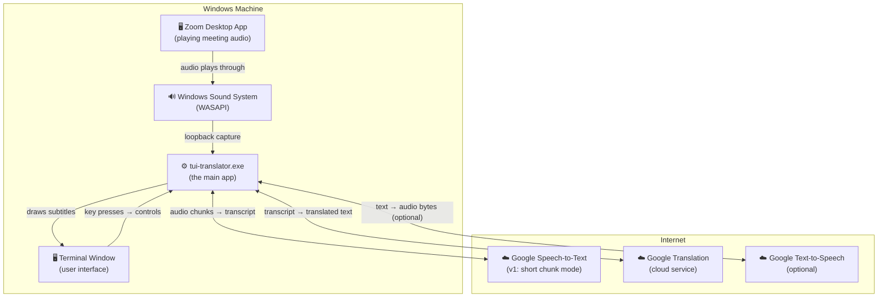
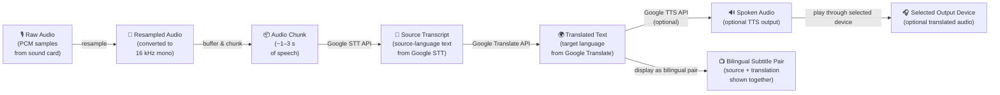
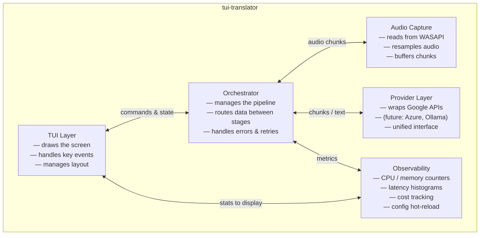
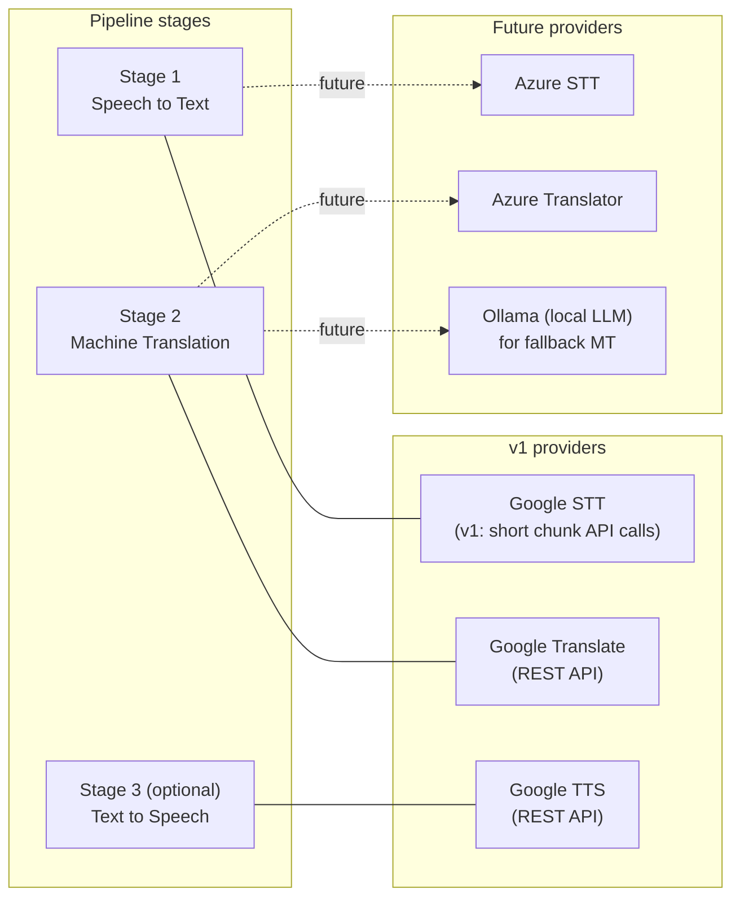

# System Design: TUI Translator

> **Audience:** This document is written for readers who are not software engineers. Technical
> terms are explained in plain language the first time they appear. Engineers building the
> product should treat this as the authoritative picture of how the pieces fit together.

---

## Table of Contents

1. [What This App Does](#1-what-this-app-does)
2. [Why the App Must Run Natively on Windows](#2-why-the-app-must-run-natively-on-windows)
3. [The Docker Question — Answered](#3-the-docker-question--answered)
4. [Runtime Topology — The Big Picture](#4-runtime-topology--the-big-picture)
5. [Data Flow: From Zoom Audio to Translated Text](#5-data-flow-from-zoom-audio-to-translated-text)
6. [Module Boundaries](#6-module-boundaries)
7. [Terminal User Interface (TUI) Behavior](#7-terminal-user-interface-tui-behavior)
8. [Audio Capture Strategy](#8-audio-capture-strategy)
9. [Provider Stages Architecture](#9-provider-stages-architecture)
10. [Observability — Watching the App from Inside](#10-observability--watching-the-app-from-inside)
11. [Runtime Controls](#11-runtime-controls)
12. [Packaging and Deployment](#12-packaging-and-deployment)
13. [Decision Log](#13-decision-log)

---

## 1. What This App Does

TUI Translator listens to audio from an active Zoom meeting, converts it to text
(speech-to-text, or STT), translates that text into a target language, and displays the
result as live bilingual subtitles inside a terminal window. The original line stays next to
or directly above the translated line so the user can compare them. An optional second
channel can speak the translated text aloud (text-to-speech, or TTS) through the user's
speakers.

The app is designed as a **self-contained tool that works entirely on the user's machine**,
without requiring the Zoom host to turn on any special settings.

---

## 2. Why the App Must Run Natively on Windows

To produce live subtitles, the app needs to hear Zoom's audio as it plays. On Windows this
is done by reading the audio signal directly from the sound system — a technique called
**loopback capture**. Loopback capture is a privileged, low-level operation that requires
the program to run directly on the same machine where Zoom is playing.

The key constraint is this: **only a program that runs natively on the Windows operating
system can access Zoom's audio stream**. A program running inside a container (such as
Docker) is isolated from the real sound hardware and cannot reach Zoom's audio unless
complex, brittle passthrough bridges are set up — a tradeoff that is not worth accepting
for a product that must feel reliable and easy to install.

Additionally, the app does not depend on Zoom being in "host" mode. It does not use Zoom's
built-in captions or interpretation features, because those are controlled by whoever started
the meeting and may not be available to guests. The app captures audio independently.

---

## 3. The Docker Question — Answered

**Docker will not be the primary delivery model for this product.**

Docker is a popular technology for packaging software, but it creates an isolation boundary
between the program and the machine it runs on. That isolation is useful for server software,
but it makes loopback audio capture impossible or unreliable on Windows without workarounds
that are fragile and hard for users to manage.

The final, resolved answer is:

| Use case | Docker allowed? | Reason |
|---|---|---|
| Main interactive app | ❌ No | Needs real access to Zoom audio |
| Local development environment | ✅ Yes | Developers can build and test non-audio parts |
| Continuous integration (CI) | ✅ Yes | Tests that do not touch real audio run fine |
| Optional sidecar services | ✅ Yes | Logging collectors, mock API servers, etc. |

The user-facing application ships as a **single native Windows executable** (a `.exe` file).
There is no Docker image for end users to install.

---

## 4. Runtime Topology — The Big Picture

The diagram below shows every component that is running when the app is active. Each box
is a distinct "process" or logical piece of the system; arrows show which direction
information flows.



**Reading the diagram:**

- Zoom plays audio through the normal Windows sound system.
- The app quietly reads that audio in the background (the loopback step).
- The app sends short audio clips to Google's cloud service, which sends back a text
  transcript.
- The transcript is sent to Google Translation, which returns the translated sentence.
- The source line and translated line appear together on screen as a bilingual pair.
- The user's key presses control the app (pause, quit, toggle TTS, etc.).

---

## 5. Data Flow: From Zoom Audio to Translated Text

This diagram zooms in on one sentence traveling through the pipeline. Each stage transforms
the data into the next form.



**Key points:**

- **Resampling** converts the audio from the format the sound card uses (often 44 100 Hz
  stereo) to the format Google's STT service expects (16 000 Hz mono). This step does not
  affect audio quality noticeably for speech.
- **Chunking** splits the continuous audio stream into short pieces so they can be sent
  over the internet without waiting for a sentence to finish.
- **Bilingual display** keeps the source line and translated line together so the user can
  compare what was said against the translation.
- **TTS output** is optional. If the user enables it, the translated sentence is also
  converted back into spoken audio and played through their speakers.

---

## 6. Module Boundaries

This diagram shows the internal organisation of the app itself. Each boundary represents
a self-contained section of the code that has one clear responsibility.



**What each module does:**

| Module | Plain-language job |
|---|---|
| **TUI Layer** | Draws everything you see on screen and converts your key presses into commands |
| **Orchestrator** | The central coordinator — it keeps all other modules working together and handles errors |
| **Audio Capture** | Reads Zoom audio from the sound card and prepares it for the API calls |
| **Provider Layer** | Talks to cloud services (Google today, others later) and hides the API differences from the rest of the app |
| **Observability** | Watches the app itself — how fast it is, how much it costs, whether the config has changed |

---

## 7. Terminal User Interface (TUI) Behavior

The TUI (Terminal User Interface) is the visual layer of the app. It runs inside any
standard terminal window — the same kind of window used to type commands.

### Why a terminal and not a regular graphical window?

A terminal interface starts quickly, uses very little memory, and works over remote
connections (SSH). It can be resized freely and runs on any monitor configuration. For
a power-user productivity tool that stays open during meetings, a terminal is the right
fit.

### How the screen is drawn

The app uses a technique called **double-buffering with diff rendering**. This means:

1. The app builds a complete picture of what the screen should look like (the "next frame").
2. It compares that picture to what is currently on screen (the "current frame").
3. It sends only the characters that changed to the terminal.

The result is that the screen updates smoothly and without visible flicker, even when
new subtitle lines arrive rapidly.

### Responsive layout

When the user resizes the terminal window, the app detects the new size and reflows the
layout immediately. No restart is required. The subtitle area, status bar, and control
hints all adjust to fit the available space.

### Screen regions

The terminal window is divided into three main areas, with the metrics section adapting to
the width of the terminal:

```
┌─────────────────────────────────────────────────────────────┐
│  Status strip                                               │
│  (provider, languages, mode, cost, latency, TTS state)      │
│  Metrics strip                                               │
│  (CPU, RAM, net up/down, loss, retries)                     │
├─────────────────────────────────────────────────────────────┤
│                                                             │
│  Bilingual subtitle pane                                    │
│  [SOURCE] original line                                     │
│  [TARGET] translated line                                   │
│                                                             │
├─────────────────────────────────────────────────────────────┤
│  Control bar                                                │
│  (? help | Space pause | T audio | L language | Q quit)     │
└─────────────────────────────────────────────────────────────┘
```

On wide terminals, the metrics strip may expand into a dedicated right-hand pane. On narrow
terminals, the same information collapses into a compact strip and can be expanded with a
single key press.

### Key bindings

All controls are single key presses. Common bindings:

| Key | Action |
|---|---|
| `Space` | Pause / resume the audio pipeline |
| `L` | Change the target language |
| `T` | Toggle spoken TTS output on or off |
| `M` | Expand / collapse the detailed metrics view |
| `R` | Force reload `config.json` |
| `?` | Show or hide the help overlay |
| `Q` or `Ctrl-C` | Quit the app cleanly |

---

## 8. Audio Capture Strategy

### How it works on Windows

Windows exposes audio through a system called **WASAPI** (Windows Audio Session API).
The app uses WASAPI in **loopback mode**, which means it records the audio that is being
played through the speakers rather than what a microphone picks up. This is why the app
can hear Zoom without any microphone.

### Targeting the right audio

Version 1 uses **full system loopback** as the default path because it works on the broadest
set of Windows 10 and Windows 11 machines and requires the fewest machine-specific
assumptions. In that mode, users are advised to mute other audio-producing programs during
meetings.

Newer versions of Windows can support **per-process loopback**, which means the app can be
configured to listen only to Zoom's audio and ignore other programs (music, notifications,
etc.). That is a desirable future option, but it is treated as a later validation gate
rather than a guaranteed v1 path.

A documented fallback exists for machines where built-in loopback is unavailable or
unreliable: routing audio through a virtual audio cable (such as VB-CABLE) and letting the
app read from that virtual device.

### Converting the audio format

Google's STT service expects audio at 16 000 samples per second in mono (one channel).
Sound cards typically produce audio at 44 100 or 48 000 samples per second in stereo.
The app uses a **resampler** to convert between these formats without audible distortion.
This conversion happens entirely on the local machine before any data is sent to the cloud.

### Handling gaps and silence

Silence detection prevents the app from wasting API calls on empty audio. When no speech
has been detected for a short interval, the pipeline pauses the STT request. Chunking
decisions are made based on audio energy levels, not on fixed time windows.

---

## 9. Provider Stages Architecture

The "provider" is the cloud service that does the speech-to-text, translation, and
optional text-to-speech work. The app is designed so that swapping or combining providers
later does not require rewriting the rest of the app.

### The stage concept

Each step in the pipeline is called a **stage**. Every stage has a well-defined input and
output, and is connected to a specific provider only at the configuration level.



### v1: Google only

In version 1 the app uses Google services for all three stages that ship: STT, Translation,
and optional TTS. This matches the current reality: only a Google API key is available for
testing, and the Google Translate and TTS services work well in Rust through standard HTTP
calls.

For STT, the v1 baseline uses short rolling audio chunks sent to Google and rendered as
near-real-time subtitle updates. A later validation phase can test lower-latency community
gRPC streaming on real hardware before it is adopted.

### Why not Azure in v1?

Microsoft's Azure Speech SDK does not have an official Rust version. A community-maintained
alternative exists, but it has not yet been verified to support the streaming STT path
needed for real-time subtitles. Azure remains a valid future option once that gap is
confirmed to be resolved.

### Why not Ollama for STT?

Ollama runs local large language models (LLMs) but does not perform speech-to-text.
Ollama may be added in future versions as a local fallback for the translation stage when
internet connectivity is poor or when cost control is a priority.

### How provider switching will work in future versions

A future version may route different languages to different providers, or fall back to
Ollama when the cloud services are unreachable. The stage-based architecture makes this
possible without changing the TUI or audio capture layers.

---

## 10. Observability — Watching the App from Inside

Observability means the app can report on its own health and performance without the user
having to dig into log files. The goal is to surface the most important numbers directly
in the status bar.

### What is tracked

| Metric | Where shown | Why it matters |
|---|---|---|
| End-to-end latency | Status bar | How many seconds behind the speaker the subtitles are |
| API cost estimate | Status bar | Running estimate in dollars (or units) since the session started |
| CPU and memory usage | Status bar (compact) | Warns if the app is stressing the machine |
| Network upload / download | Metrics strip or side pane | Shows whether audio and API traffic are flowing as expected |
| Loss / retry rate | Metrics strip or side pane | Shows the share of audio chunks or provider requests that had to be retried or were dropped |
| Provider error count | Status bar | Shows if API calls are failing repeatedly |

### Latency histogram

The app keeps a histogram (a statistical summary) of recent latency values. This allows
the status bar to show not just the current latency but also whether it has been stable or
spiking. The histogram uses a well-established technique (HDR histogram) that is accurate
across a very wide range of values without using much memory.

The app exposes "loss" as an application-level signal rather than a raw network packet
counter. In practice, this means the percentage of audio chunks or provider requests that
were dropped or had to be retried. That is the actionable number a user can understand.

### Cost counter

Cost is computed locally from two inputs:

1. The number of audio seconds sent to the STT service.
2. The number of characters sent to the Translation service.

The app applies known pricing tiers to produce a running dollar estimate. This is an
approximation, not a billing-exact figure, but it is close enough to be useful for
staying within a budget. The release target is that this estimate stays within 10% of the
provider's actual bill during soak-test verification.

### Hot configuration reload

When the user edits the configuration file while the app is running, the app detects the
change automatically (using a file-system watcher) and reloads the relevant settings
without restarting. Settings that can be hot-reloaded include: target language, TTS
toggle, metrics density, and API endpoint overrides. Settings that require a restart
(such as the audio device) are flagged clearly in the setup guide for `config.json`.

---

## 11. Runtime Controls

Runtime controls are actions the user can take while the app is running, without restarting.

### Keyboard controls

All keyboard controls are single key presses (no modifier keys required for common actions).
The control bar at the bottom of the screen always shows the active key hints, so the user
does not need to remember them.

### Pause and resume

Pressing `Space` pauses the entire audio pipeline. While paused:

- No audio is read from the sound card.
- No API calls are made (no cost is accrued).
- The screen holds the last subtitle visible.
- A clear "PAUSED" indicator replaces the status bar's normal content.

Pressing `Space` again resumes immediately.

### Language switch

Pressing `L` switches to the next preconfigured target language. This is useful when the
meeting changes language mid-session. The same result can also be achieved by editing
`config.json` and reloading it.

### TTS toggle

Pressing `T` toggles spoken output. When TTS is off, the translation stage still runs
(subtitles appear) but no text-to-speech API calls are made and no audio is sent to the
speakers. This is useful when the user is in a quiet environment.

### Metrics detail toggle

Pressing `M` expands or collapses the detailed metrics view. In a narrow terminal this
switches between a compact one-line summary and a fuller view that shows CPU, RAM, network
up/down, latency, loss, and retry state.

### Configuration reload

Pressing `R` forces the app to reload `config.json` immediately, without waiting
for the automatic file-watcher to detect a change.

### Clean shutdown

`Q` or `Ctrl-C` triggers a graceful shutdown sequence:

1. The audio capture stops reading new samples.
2. Any in-flight API calls are awaited for up to two seconds.
3. The screen is cleared and the terminal cursor is restored to its normal state.
4. The process exits with a zero exit code (success).

This ensures the terminal is not left in a broken visual state after the app closes.

---

## 12. Packaging and Deployment

### What the user installs

The app is distributed as a **single `.exe` file** for 64-bit Windows, alongside a
plain-text `config.json` file. There is no installer wizard. For the normal supported
Windows loopback path, the user does not need to install extra audio software. If a
specific older machine needs the documented fallback path, that is called out explicitly in
the setup guide.

### First-run setup

The first time the user runs the app, it:

1. Looks for `config.json` beside the executable.
2. If none is found, writes a starter `config.json` file with sensible defaults.
3. Prints a short message telling the user to fill in their Google API key, then exits.

After that, the app starts normally every time.

### Configuration file

Settings are stored in a plain JSON file (`config.json`). The user edits it with any text
editor. Because JSON does not support comments, the repository ships with
`config.example.json` and a one-page setup guide that explains every field. The stage names
(`stt`, `translate`, `tts`) are present from day one, even though only Google values are
valid in v1.

### Auto-update

Version 1 does not include an auto-update mechanism. The user downloads a new `.exe` and
replaces the old one. Future versions may add a self-update command.

### Deployment checklist

| Step | Done by | Notes |
|---|---|---|
| Download the `.exe` | User | From the project's GitHub Releases page |
| Create and fill in `config.json` | User | First run creates the template |
| Set the Google API key | User | Stored in `config.json` |
| Verify audio device is accessible | User | App reports if it cannot open WASAPI |
| Start the app before joining a Zoom call | User | Starting after Zoom is also fine |

### Why no Docker for end users

A Docker container runs in an isolated environment that does not have direct access to
the Windows sound system. Passing audio through to a container requires extra drivers,
custom host configuration, and is fragile across different Windows versions. Since the
single `.exe` approach is simpler, faster to install, and more reliable, Docker is
reserved for developers and test automation only. This decision is final for v1 and is
not expected to change in v2 either, because the core audio-capture requirement will not
change.

---

## 13. Decision Log

| # | Question | Decision | Reasoning |
|---|---|---|---|
| D-01 | Should the app run in Docker? | No — native `.exe` for end users | WASAPI loopback cannot pass reliably through Docker on Windows |
| D-02 | Which TUI library? | ratatui + crossterm + tokio | Proven in major Rust TUI projects; diff-based rendering avoids blink |
| D-03 | Which audio capture library? | wasapi-rs | Most complete Rust binding for Windows loopback capture |
| D-04 | Which provider in v1? | Google only | User has a Google key; Google fills the STT, Translation, and optional TTS slots in the first release |
| D-05 | How is multi-provider added later? | Stage-based abstraction | Each stage (STT, MT, TTS) can be routed to any compliant provider without touching the UI or audio layers |
| D-06 | Azure in v1? | No — deferred | No official Rust SDK; community crate's streaming path is unverified |
| D-07 | Ollama role? | Translation fallback only (future) | Ollama does not do STT; suitable for offline or low-cost translation |
| D-08 | Cost tracking? | Client-side estimate | Computed from audio seconds and character counts using known pricing tiers |
| D-09 | Hot reload? | Yes — file-system watcher | Language, TTS, and metrics settings can change mid-session; audio device requires restart |
| D-10 | Subtitle rendering strategy? | Double-buffer + diff send | Eliminates full-screen redraws; makes subtitles feel smooth |

---

*Document version: 1.0 — last updated by system-design tentacle, 2026-05-11*
